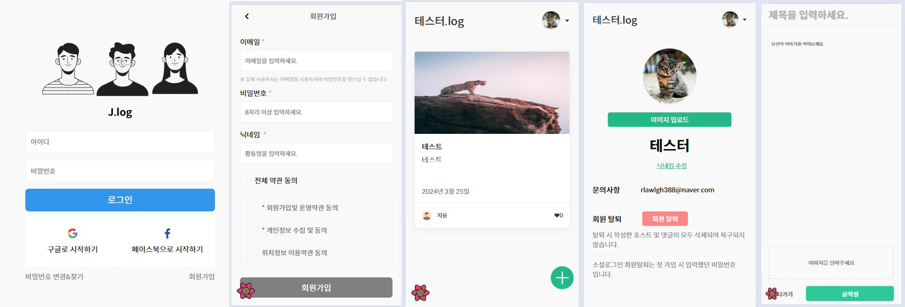
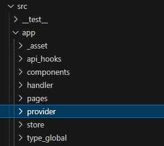
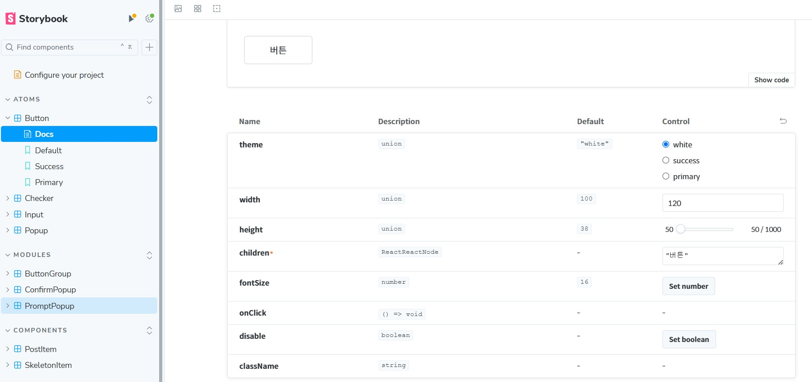
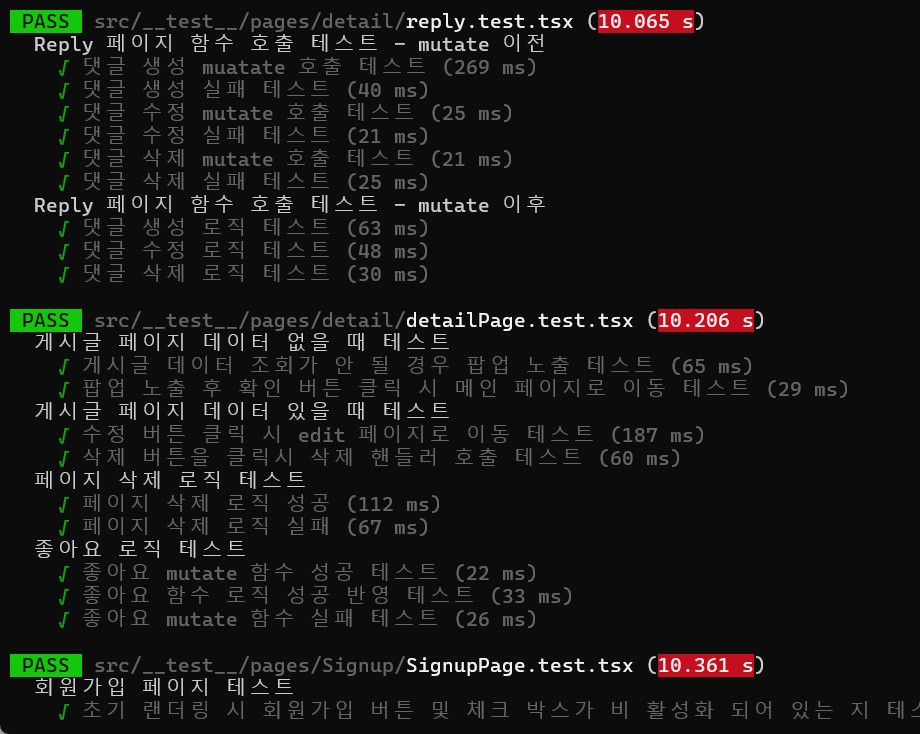

# 벨로그 클론코딩

 

본 프로젝트는 사이트 기획과 디자인 기간 단축을 위해 클론코딩으로 이루어져 있으며 다음과 같은 기술들을 사용합니다.

- 개발 언어 : Typescript & React
- 개발 환경 : Next.js 14
- UI 스타일링 : emotion & SCSS
- 컴포넌트 관리 : Storybook
- 클라이언트 상태관리 : zustand
- 서버 상태관리 : React Query
- 사용 DB : Firebase
- 테스트 : Jest + RTL
- 형상관리 : github
- CI/CD : git actions
- privatekey : env으로 처리
   
   

## 프로젝트 기술 채용 이유

1. 개발언어 : 현재 프론트엔드 채용 시장에서 가장 많이 사용되는 typescript 및 React로 선정 
2. 개발환경 : 본 프로젝트가 블로그형 커뮤니티 프로젝트 이기에 SEO가 필요하다고 생각 CSR인 React 보다는 SSR인 NEXT.JS를 사용 하는 것이 적합하다고 느껴 채용 
   (하지만 SSR의 제대로 된 사용은 못 해본 상황, 아무래도 서버 통신을 React query로 하기 때문이라고 생각) 
3. UI 스타일링

- styled components를 사용하지 않은 이유 : SSR에선 서버 > 클라이언트에서 한 페이지의 HTML을 생성하여 보낸 후   클라이언트에서 hyduration 작업을 하게 되는데
  이 작업 중 styled가 누락되어 document나 layout에서 한번더 ssr 사용 작업을 해줘야 하기 때문 
- tailwind를 사용 하지 않은 이유 : 본 프로젝트에서는 reset 관련 스타일링은 css / 페이지 레이아웃 관련 스타일링은 scss / 공용 컴포넌트 관련 스타일링은 emotion으로 진행 하기 때문에 tailwind가 필요 하지 않음
   

4. 컴포넌트 관리 : 현재 제작된 컴포넌트를 한 화면에서 알 수 있는 스토리북을 채용, 컴포넌트의 경우 아토믹 디자인 패턴을 이용하여 작은 atom 단계의 컴포넌트를 먼저 만든 후 atom과 atom 을 합친 modules 단계까지 구현 
5. 클라이언트 상태관리 : 클라이언트에서 zustand를 사용 한 이유는 root에 라이브러리 middleward를 설정하지 않아도 되기 때문 가장 가볍고 가장 사용하기 용이함 
6. 서버 상태관리 : DB에서 데이터를 가져온 후 캐싱 / 저장 / 재 호출이 용이한 React-query를 채용 
7. DB : 수 많은 모의 API 라이브러리가 있지만 실제 DB와 연결 할 수 있는 프로젝트를 진행 하기 위해 firebase를 도입 
8. 테스트 : 비동기 통신 함수의 성공과 실패 여부에서 내가 놓친게 있는지 테스트 할 수 있게 jest를 도입 
9. 형상관리 : 실무 프로젝트에서는 gitlab을 사용 했지만 github이 gitlab 보다 public 공개가 수월하다고 생각하여 도입

## Preview

  

## directory map

  

## storybook Preview

  

## test preview

  

### 📌 주요기능

- 로그인/회원가입/SNS로그인/비밀번호 찾기
- 홈에 게시물들 노출/게시글 작성/댓글작성/게시글 좋아요
- 게시글 수정&삭제/이미지추가&수정&삭제
- 프로필변경/닉네임변경/회원탈퇴
