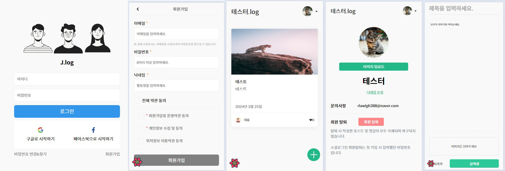

# 벨로그 클론코딩

 

본 프로젝트는 사이트 기획과 디자인 기간 단축을 위해 클론코딩으로 이루어져 있으며,
본 프로젝트는 위와 같은 기술들로 이루워져 있습니다.

개발 언어 : Typescript & React
개발 환경 : Next.js 14
UI :

- 스타일링 : emotion & SCSS
- 컴포넌트 관리 : Storybook
  상태관리 :
  클라이언트 상태관리 : zustand
  서버 상태관리 : React Query
  사용 DB : Firebase
  테스트 : Jest + RTL
  형상관리 : github
  CI/CD : git actions
   
   

## 프로젝트 아이디어

1. 개인 사이드 프로젝트를 하면서 백엔드를 연동 할 수 없을까 생각하다 firebase 를 채용
2. firebase와 api 통신을 하면서 상태관리에 간편한 react-query를 채용
    
    

## Preview

  
